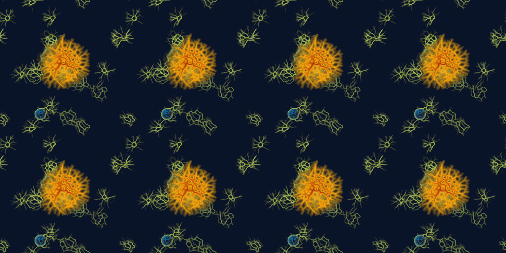

# Example


This code shows how to implement a simple physarum-simulation in python, using my `physarum`-package.  The package is heavily inspired by/derivative of work by [**Sage Jenson**](https://sagejenson.com/physarum) and [**Jason Rampe**](https://softologyblog.wordpress.com/2019/04/11/physarum-simulations/), and geared towards the production of digital art and playful experimentation. Have fun!

## Installation

You should be able to install the package with a simple:
`pip install physarum`


## Usage
We start by importing the `physarum`-package.


```python
%load_ext autoreload
%autoreload 2
import physarum


```


```python
# # standards:
# import numpy as np
# import matplotlib.pyplot as plt
# import seaborn as sns

# # image utils:
# from PIL import Image as IMG
# from IPython.display import Image 
# from skimage import data, color
# from skimage.transform import rescale, resize, downscale_local_mean
# import cv2 # for rescaling

# # for the blurring:
# from scipy.ndimage.filters import gaussian_filter, uniform_filter

# # to monitor progress:
# import tqdm

# # to save movies:
# import imageio
# from datetime import datetime

# # for colormaps
# import palettable
# import cmocean 
# from colorsys import hls_to_rgb
# from matplotlib import cm
# from matplotlib.colors import ListedColormap, LinearSegmentedColormap

# # to speed up computation
# import numba

# # noise for the starting-positions:
# import noise
# from scipy import interpolate
```

## Setting up the colormaps
Before we run our simulation, we have to set up the colormaps that we want to use for each of our physarum-populations. I like to use the little function below that allows me to produce colormaps from a list of `[hue,chroma,luminosity]`-triples, but in principle you can just use any matplotlib-colormap.

The first colormap can be fully opaque, but the other two will be overlayed, so the will need some transparancy given by the ` alpha-distribution`-parameter in the form `[alpha with which to start, percentage at which to start, alpha with which to end, percentage at which to end]`. The current examples leave the bottom 10% of the colormap fully transparent, the top 20% at 90% transparency, with a regular increase in between.

The function also automatically plots your colormap. With the basecolor-parameter, you can set the background of this plot.


```python
### # make_colormap([[0,90,50],[50,90,50],[100,90,50],[150,90,50],[200,90,50],[250,90,50],[300,90,50],[350,90,50]],alpha=False)
species_a_color = physarum.make_colormap([[30,56,72],[225,42,17]],alpha_distribution=False)
species_b_color = physarum.make_colormap([[27,94,58],[2,100,50]],alpha_distribution=[0.1,0.1,0.9,0.8], basecolor= species_a_color(0))


```


## Setting up basic parameters

We set up the basic parameters for our simulation: width, height (in px) and the amount of itererations for which we want it to run. 


```python
width = 1500
height = 1500
t = 200 
```

## Setting up the initial positions
Then we have to set up the initial positions of our particles. The package provides several functions for this, which all return a tuple of xy-coordinates. A list of these tuples will then be passed to the init-function when we construct a physarum-population.

In this example, we set up a population that is initiated with a large circle made of 100000 particles in the center and some perlin-noise (300000 particles) around it. To see how that looks like, we then plot the resulting coordinates with matplotlib.


```python
init=[physarum.get_filled_circle_init(n=100000, center=(750,750),radius=300),
        physarum.get_perlin_init(shape=(height,width), n=300000,scale=380)]


# plot the init with matplotlib (not necessary, only for illustration):
import matplotlib.pyplot as plt
fig, ax = plt.subplots(figsize=(5,5))
init_to_plot = np.vstack([i[0] for i in init]),np.vstack([i[1] for i in init])
init_to_plot = np.hstack(init_to_plot)

plt.scatter(init_to_plot[:,0],init_to_plot[:,1],s=0.1, c='black',alpha=0.2)
```


    <matplotlib.collections.PathCollection at 0x1affcde8988>


## Setting up the populations

Now we set up our physarum-populations. There are several parameters to play with. First we need to inform each population about the environment it's living in by passing it the height, width and time-parameters. Then we need to set up the length of every step which each particle will do in every tick of the simulation (`horizon_walk`), and how far ahead the particle will look before doing that step (`horizon_sense`).


```python
species_a = physarum.physarum_population(height=height,width=width,t=t,
                                horizon_walk=4,horizon_sense=9,
                                theta_walk=15,theta_sense=10.,walk_range = [1.,2.],
                                colormap=species_a_color,
                                social_behaviour =0,trace_strength = 1,
                                initialization=init)


species_b = physarum.physarum_population(height=height,width=width,t=t,
                                horizon_walk=4,horizon_sense=9,
                                theta_walk=15,theta_sense=10.,walk_range = [0.9,1.2],
                                colormap=species_b_color,
                                social_behaviour = -16,trace_strength = 1,
                                initialization=[physarum.get_perlin_init(shape=(height,width), n=300000,scale=380)])


```

## Running the simulation


```python

species_list = [species_a,species_b]
images=[]
physarum.run_physarum_simulation(populations = species_list, image_list=images,show_image_every=50)
```


    HBox(children=(HTML(value=''), FloatProgress(value=0.0, max=200.0), HTML(value='')))


    Step No.: 0
    


    Step No.: 50
    


    Step No.: 100
    


    Step No.: 150
    


    
    


    [<PIL.Image.Image image mode=RGBA size=1500x1500 at 0x1AF82372188>,
     <PIL.Image.Image image mode=RGBA size=1500x1500 at 0x1AFE9DCD688>,
     <PIL.Image.Image image mode=RGBA size=1500x1500 at 0x1AF82466108>,
     <PIL.Image.Image image mode=RGBA size=1500x1500 at 0x1AF85DB4548>,
     <PIL.Image.Image image mode=RGBA size=1500x1500 at 0x1AF822C1488>,
     <PIL.Image.Image image mode=RGBA size=1500x1500 at 0x1AF87102608>,
     <PIL.Image.Image image mode=RGBA size=1500x1500 at 0x1AF87102DC8>,
     <PIL.Image.Image image mode=RGBA size=1500x1500 at 0x1AF8236AFC8>,
     <PIL.Image.Image image mode=RGBA size=1500x1500 at 0x1AF8236AD48>,
     <PIL.Image.Image image mode=RGBA size=1500x1500 at 0x1AF860EDD48>,
     <PIL.Image.Image image mode=RGBA size=1500x1500 at 0x1AF860EDD88>,
     <PIL.Image.Image image mode=RGBA size=1500x1500 at 0x1AF860EDB08>,
     <PIL.Image.Image image mode=RGBA size=1500x1500 at 0x1AF860EDE48>,
     <PIL.Image.Image image mode=RGBA size=1500x1500 at 0x1AF860EDFC8>,
     <PIL.Image.Image image mode=RGBA size=1500x1500 at 0x1AF860EDE88>,
     <PIL.Image.Image image mode=RGBA size=1500x1500 at 0x1AF860EDB88>,
     <PIL.Image.Image image mode=RGBA size=1500x1500 at 0x1AF860EDE08>,
     <PIL.Image.Image image mode=RGBA size=1500x1500 at 0x1AF860ED5C8>,
     <PIL.Image.Image image mode=RGBA size=1500x1500 at 0x1AF860EDF08>,
     <PIL.Image.Image image mode=RGBA size=1500x1500 at 0x1AF860ED6C8>,
     <PIL.Image.Image image mode=RGBA size=1500x1500 at 0x1AF860EDA48>,
     <PIL.Image.Image image mode=RGBA size=1500x1500 at 0x1AF860EDC48>,
     <PIL.Image.Image image mode=RGBA size=1500x1500 at 0x1AF860ED748>,
     <PIL.Image.Image image mode=RGBA size=1500x1500 at 0x1AF860ED788>,
     <PIL.Image.Image image mode=RGBA size=1500x1500 at 0x1AF860EDC08>,
     <PIL.Image.Image image mode=RGBA size=1500x1500 at 0x1AF82365888>,
     <PIL.Image.Image image mode=RGBA size=1500x1500 at 0x1AF92A9EC48>,
     <PIL.Image.Image image mode=RGBA size=1500x1500 at 0x1AF87102E88>,
     <PIL.Image.Image image mode=RGBA size=1500x1500 at 0x1AF860ED8C8>,
     <PIL.Image.Image image mode=RGBA size=1500x1500 at 0x1AF860ED9C8>,
     <PIL.Image.Image image mode=RGBA size=1500x1500 at 0x1AF860ED888>,
     <PIL.Image.Image image mode=RGBA size=1500x1500 at 0x1AF87102708>,
     <PIL.Image.Image image mode=RGBA size=1500x1500 at 0x1AF8605DA08>,
     <PIL.Image.Image image mode=RGBA size=1500x1500 at 0x1AF857CFA08>,
     <PIL.Image.Image image mode=RGBA size=1500x1500 at 0x1AF8230D4C8>,
     <PIL.Image.Image image mode=RGBA size=1500x1500 at 0x1AF8605DBC8>,
     <PIL.Image.Image image mode=RGBA size=1500x1500 at 0x1AF8235C708>,
     <PIL.Image.Image image mode=RGBA size=1500x1500 at 0x1AF860CB908>,
     <PIL.Image.Image image mode=RGBA size=1500x1500 at 0x1AF860CBCC8>,
     <PIL.Image.Image image mode=RGBA size=1500x1500 at 0x1AF860CB048>,
     <PIL.Image.Image image mode=RGBA size=1500x1500 at 0x1AF860CB148>,
     <PIL.Image.Image image mode=RGBA size=1500x1500 at 0x1AF860ED908>,
     <PIL.Image.Image image mode=RGBA size=1500x1500 at 0x1AF860CB2C8>,
     <PIL.Image.Image image mode=RGBA size=1500x1500 at 0x1AF860DC548>,
     <PIL.Image.Image image mode=RGBA size=1500x1500 at 0x1AF860DCC48>,
     <PIL.Image.Image image mode=RGBA size=1500x1500 at 0x1AF860DC908>,
     <PIL.Image.Image image mode=RGBA size=1500x1500 at 0x1AF860DC048>,
     <PIL.Image.Image image mode=RGBA size=1500x1500 at 0x1AF8605DDC8>,
     <PIL.Image.Image image mode=RGBA size=1500x1500 at 0x1AF860CB0C8>,
     <PIL.Image.Image image mode=RGBA size=1500x1500 at 0x1AF871148C8>,
     <PIL.Image.Image image mode=RGBA size=1500x1500 at 0x1AF87114C88>,
     <PIL.Image.Image image mode=RGBA size=1500x1500 at 0x1AF87114E48>,
     <PIL.Image.Image image mode=RGBA size=1500x1500 at 0x1AF87114B48>,
     <PIL.Image.Image image mode=RGBA size=1500x1500 at 0x1AF87114148>,
     <PIL.Image.Image image mode=RGBA size=1500x1500 at 0x1AF8235CFC8>,
     <PIL.Image.Image image mode=RGBA size=1500x1500 at 0x1AF860DCCC8>,
     <PIL.Image.Image image mode=RGBA size=1500x1500 at 0x1AF82365D88>,
     <PIL.Image.Image image mode=RGBA size=1500x1500 at 0x1AF87114948>,
     <PIL.Image.Image image mode=RGBA size=1500x1500 at 0x1AF8235A048>,
     <PIL.Image.Image image mode=RGBA size=1500x1500 at 0x1AF82356488>,
     <PIL.Image.Image image mode=RGBA size=1500x1500 at 0x1AF82377488>,
     <PIL.Image.Image image mode=RGBA size=1500x1500 at 0x1AF87103248>,
     <PIL.Image.Image image mode=RGBA size=1500x1500 at 0x1AF87103148>,
     <PIL.Image.Image image mode=RGBA size=1500x1500 at 0x1AF87103D48>,
     <PIL.Image.Image image mode=RGBA size=1500x1500 at 0x1AF87103DC8>,
     <PIL.Image.Image image mode=RGBA size=1500x1500 at 0x1AF871034C8>,
     <PIL.Image.Image image mode=RGBA size=1500x1500 at 0x1AF87103F88>,
     <PIL.Image.Image image mode=RGBA size=1500x1500 at 0x1AF87103788>,
     <PIL.Image.Image image mode=RGBA size=1500x1500 at 0x1AF82332AC8>,
     <PIL.Image.Image image mode=RGBA size=1500x1500 at 0x1AF870E1B08>,
     <PIL.Image.Image image mode=RGBA size=1500x1500 at 0x1AF870E1448>,
     <PIL.Image.Image image mode=RGBA size=1500x1500 at 0x1AF870E1948>,
     <PIL.Image.Image image mode=RGBA size=1500x1500 at 0x1AF870E1D48>,
     <PIL.Image.Image image mode=RGBA size=1500x1500 at 0x1AF870E1308>,
     <PIL.Image.Image image mode=RGBA size=1500x1500 at 0x1AF870E1108>,
     <PIL.Image.Image image mode=RGBA size=1500x1500 at 0x1AF870E1F48>,
     <PIL.Image.Image image mode=RGBA size=1500x1500 at 0x1AF870E1148>,
     <PIL.Image.Image image mode=RGBA size=1500x1500 at 0x1AF870E1548>,
     <PIL.Image.Image image mode=RGBA size=1500x1500 at 0x1AF870E1D08>,
     <PIL.Image.Image image mode=RGBA size=1500x1500 at 0x1AF870E1E48>,
     <PIL.Image.Image image mode=RGBA size=1500x1500 at 0x1AF870E1EC8>,
     <PIL.Image.Image image mode=RGBA size=1500x1500 at 0x1AF870E15C8>,
     <PIL.Image.Image image mode=RGBA size=1500x1500 at 0x1AF870E1348>,
     <PIL.Image.Image image mode=RGBA size=1500x1500 at 0x1AF870E1BC8>,
     <PIL.Image.Image image mode=RGBA size=1500x1500 at 0x1AF870E1048>,
     <PIL.Image.Image image mode=RGBA size=1500x1500 at 0x1AF870E1908>,
     <PIL.Image.Image image mode=RGBA size=1500x1500 at 0x1AF870E1E08>,
     <PIL.Image.Image image mode=RGBA size=1500x1500 at 0x1AF92A8B488>,
     <PIL.Image.Image image mode=RGBA size=1500x1500 at 0x1AF870E13C8>,
     <PIL.Image.Image image mode=RGBA size=1500x1500 at 0x1AF870E1608>,
     <PIL.Image.Image image mode=RGBA size=1500x1500 at 0x1AF870E1A48>,
     <PIL.Image.Image image mode=RGBA size=1500x1500 at 0x1AF870E1788>,
     <PIL.Image.Image image mode=RGBA size=1500x1500 at 0x1AF8235A908>,
     <PIL.Image.Image image mode=RGBA size=1500x1500 at 0x1AF82330BC8>,
     <PIL.Image.Image image mode=RGBA size=1500x1500 at 0x1AF82330248>,
     <PIL.Image.Image image mode=RGBA size=1500x1500 at 0x1AF860CB548>,
     <PIL.Image.Image image mode=RGBA size=1500x1500 at 0x1AF92A8B448>,
     <PIL.Image.Image image mode=RGBA size=1500x1500 at 0x1AF823AC288>,
     <PIL.Image.Image image mode=RGBA size=1500x1500 at 0x1AF870E18C8>,
     <PIL.Image.Image image mode=RGBA size=1500x1500 at 0x1AF870E1248>,
     <PIL.Image.Image image mode=RGBA size=1500x1500 at 0x1AF8242E8C8>,
     <PIL.Image.Image image mode=RGBA size=1500x1500 at 0x1AF822FC788>,
     <PIL.Image.Image image mode=RGBA size=1500x1500 at 0x1AF823A9BC8>,
     <PIL.Image.Image image mode=RGBA size=1500x1500 at 0x1AF822EDA48>,
     <PIL.Image.Image image mode=RGBA size=1500x1500 at 0x1AF82432F48>,
     <PIL.Image.Image image mode=RGBA size=1500x1500 at 0x1AF82330148>,
     <PIL.Image.Image image mode=RGBA size=1500x1500 at 0x1AF8242E908>,
     <PIL.Image.Image image mode=RGBA size=1500x1500 at 0x1AF8232EC88>,
     <PIL.Image.Image image mode=RGBA size=1500x1500 at 0x1AF87114E08>,
     <PIL.Image.Image image mode=RGBA size=1500x1500 at 0x1AF870D74C8>,
     <PIL.Image.Image image mode=RGBA size=1500x1500 at 0x1AF870D7D08>,
     <PIL.Image.Image image mode=RGBA size=1500x1500 at 0x1AF870D7248>,
     <PIL.Image.Image image mode=RGBA size=1500x1500 at 0x1AF870D7108>,
     <PIL.Image.Image image mode=RGBA size=1500x1500 at 0x1AF870D7288>,
     <PIL.Image.Image image mode=RGBA size=1500x1500 at 0x1AF870D79C8>,
     <PIL.Image.Image image mode=RGBA size=1500x1500 at 0x1AF82367648>,
     <PIL.Image.Image image mode=RGBA size=1500x1500 at 0x1AF870D7E08>,
     <PIL.Image.Image image mode=RGBA size=1500x1500 at 0x1AF8242EA08>,
     <PIL.Image.Image image mode=RGBA size=1500x1500 at 0x1AF92A8BD08>,
     <PIL.Image.Image image mode=RGBA size=1500x1500 at 0x1AF870D7B88>,
     <PIL.Image.Image image mode=RGBA size=1500x1500 at 0x1AF870D7608>,
     <PIL.Image.Image image mode=RGBA size=1500x1500 at 0x1AF8235AA48>,
     <PIL.Image.Image image mode=RGBA size=1500x1500 at 0x1AF870D7D88>,
     <PIL.Image.Image image mode=RGBA size=1500x1500 at 0x1AF870D7148>,
     <PIL.Image.Image image mode=RGBA size=1500x1500 at 0x1AF85ECAD48>,
     <PIL.Image.Image image mode=RGBA size=1500x1500 at 0x1AF870DD188>,
     <PIL.Image.Image image mode=RGBA size=1500x1500 at 0x1AF870DD2C8>,
     <PIL.Image.Image image mode=RGBA size=1500x1500 at 0x1AF870DD548>,
     <PIL.Image.Image image mode=RGBA size=1500x1500 at 0x1AF870DD908>,
     <PIL.Image.Image image mode=RGBA size=1500x1500 at 0x1AF870DDC88>,
     <PIL.Image.Image image mode=RGBA size=1500x1500 at 0x1AF870DD488>,
     <PIL.Image.Image image mode=RGBA size=1500x1500 at 0x1AF870DDC48>,
     <PIL.Image.Image image mode=RGBA size=1500x1500 at 0x1AF870DD808>,
     <PIL.Image.Image image mode=RGBA size=1500x1500 at 0x1AF870DDB88>,
     <PIL.Image.Image image mode=RGBA size=1500x1500 at 0x1AF870DD6C8>,
     <PIL.Image.Image image mode=RGBA size=1500x1500 at 0x1AF870DD288>,
     <PIL.Image.Image image mode=RGBA size=1500x1500 at 0x1AF870DD248>,
     <PIL.Image.Image image mode=RGBA size=1500x1500 at 0x1AF870DD388>,
     <PIL.Image.Image image mode=RGBA size=1500x1500 at 0x1AF870DD348>,
     <PIL.Image.Image image mode=RGBA size=1500x1500 at 0x1AF870DD1C8>,
     <PIL.Image.Image image mode=RGBA size=1500x1500 at 0x1AF870DD588>,
     <PIL.Image.Image image mode=RGBA size=1500x1500 at 0x1AF870DDEC8>,
     <PIL.Image.Image image mode=RGBA size=1500x1500 at 0x1AF870DDA48>,
     <PIL.Image.Image image mode=RGBA size=1500x1500 at 0x1AF870DD788>,
     <PIL.Image.Image image mode=RGBA size=1500x1500 at 0x1AF870DD5C8>,
     <PIL.Image.Image image mode=RGBA size=1500x1500 at 0x1AF870DD8C8>,
     <PIL.Image.Image image mode=RGBA size=1500x1500 at 0x1AF870DD4C8>,
     <PIL.Image.Image image mode=RGBA size=1500x1500 at 0x1AF823305C8>,
     <PIL.Image.Image image mode=RGBA size=1500x1500 at 0x1AF85DACA08>,
     <PIL.Image.Image image mode=RGBA size=1500x1500 at 0x1AF870DD0C8>,
     <PIL.Image.Image image mode=RGBA size=1500x1500 at 0x1AF870DDA08>,
     <PIL.Image.Image image mode=RGBA size=1500x1500 at 0x1AF870DD448>,
     <PIL.Image.Image image mode=RGBA size=1500x1500 at 0x1AF870DDBC8>,
     <PIL.Image.Image image mode=RGBA size=1500x1500 at 0x1AF87114FC8>,
     <PIL.Image.Image image mode=RGBA size=1500x1500 at 0x1AF870DDD08>,
     <PIL.Image.Image image mode=RGBA size=1500x1500 at 0x1AF870DA848>,
     <PIL.Image.Image image mode=RGBA size=1500x1500 at 0x1AF870DA988>,
     <PIL.Image.Image image mode=RGBA size=1500x1500 at 0x1AF870DAB08>,
     <PIL.Image.Image image mode=RGBA size=1500x1500 at 0x1AF870DA408>,
     <PIL.Image.Image image mode=RGBA size=1500x1500 at 0x1AF870DA288>,
     <PIL.Image.Image image mode=RGBA size=1500x1500 at 0x1AF870DA7C8>,
     <PIL.Image.Image image mode=RGBA size=1500x1500 at 0x1AF870DA388>,
     <PIL.Image.Image image mode=RGBA size=1500x1500 at 0x1AF870DA6C8>,
     <PIL.Image.Image image mode=RGBA size=1500x1500 at 0x1AF870DA5C8>,
     <PIL.Image.Image image mode=RGBA size=1500x1500 at 0x1AF870DAE08>,
     <PIL.Image.Image image mode=RGBA size=1500x1500 at 0x1AF870DAE48>,
     <PIL.Image.Image image mode=RGBA size=1500x1500 at 0x1AF870DAEC8>,
     <PIL.Image.Image image mode=RGBA size=1500x1500 at 0x1AF870DAF48>,
     <PIL.Image.Image image mode=RGBA size=1500x1500 at 0x1AF870DAC88>,
     <PIL.Image.Image image mode=RGBA size=1500x1500 at 0x1AF870DA8C8>,
     <PIL.Image.Image image mode=RGBA size=1500x1500 at 0x1AF870DA588>,
     <PIL.Image.Image image mode=RGBA size=1500x1500 at 0x1AF870DA348>,
     <PIL.Image.Image image mode=RGBA size=1500x1500 at 0x1AF870DA148>,
     <PIL.Image.Image image mode=RGBA size=1500x1500 at 0x1AF870DA4C8>,
     <PIL.Image.Image image mode=RGBA size=1500x1500 at 0x1AF870DA808>,
     <PIL.Image.Image image mode=RGBA size=1500x1500 at 0x1AF870DA448>,
     <PIL.Image.Image image mode=RGBA size=1500x1500 at 0x1AF870DAFC8>,
     <PIL.Image.Image image mode=RGBA size=1500x1500 at 0x1AF8242E788>,
     <PIL.Image.Image image mode=RGBA size=1500x1500 at 0x1AF85F6A788>,
     <PIL.Image.Image image mode=RGBA size=1500x1500 at 0x1AF860E3208>,
     <PIL.Image.Image image mode=RGBA size=1500x1500 at 0x1AF870DABC8>,
     <PIL.Image.Image image mode=RGBA size=1500x1500 at 0x1AF860E3588>,
     <PIL.Image.Image image mode=RGBA size=1500x1500 at 0x1AF860E33C8>,
     <PIL.Image.Image image mode=RGBA size=1500x1500 at 0x1AF860E3648>,
     <PIL.Image.Image image mode=RGBA size=1500x1500 at 0x1AF82315F48>,
     <PIL.Image.Image image mode=RGBA size=1500x1500 at 0x1AF82356508>,
     <PIL.Image.Image image mode=RGBA size=1500x1500 at 0x1AF871235C8>,
     <PIL.Image.Image image mode=RGBA size=1500x1500 at 0x1AF87123448>,
     <PIL.Image.Image image mode=RGBA size=1500x1500 at 0x1AF87123A88>,
     <PIL.Image.Image image mode=RGBA size=1500x1500 at 0x1AF8235C048>,
     <PIL.Image.Image image mode=RGBA size=1500x1500 at 0x1AF870DA308>,
     <PIL.Image.Image image mode=RGBA size=1500x1500 at 0x1AF870FE508>,
     <PIL.Image.Image image mode=RGBA size=1500x1500 at 0x1AF870FEDC8>,
     <PIL.Image.Image image mode=RGBA size=1500x1500 at 0x1AF870FEBC8>,
     <PIL.Image.Image image mode=RGBA size=1500x1500 at 0x1AF870FE288>,
     <PIL.Image.Image image mode=RGBA size=1500x1500 at 0x1AF87123208>,
     <PIL.Image.Image image mode=RGBA size=1500x1500 at 0x1AF8712B508>,
     <PIL.Image.Image image mode=RGBA size=1500x1500 at 0x1AF8712BCC8>,
     <PIL.Image.Image image mode=RGBA size=1500x1500 at 0x1AF8712B888>,
     <PIL.Image.Image image mode=RGBA size=1500x1500 at 0x1AF860E3B88>]


## Saving


```python
help(physarum.save_film)
```

    Help on function save_film in module physarum:
    
    save_film(images, name=False, fps=20, format='mp4', loop=False)
    
    


```python
physarum.save_film(images,name="example_film.mp4")

physarum.save_film(images,name="example_film.gif", format="gif")
```


```python
physarum.save_grid(images, folder='physarum_tiles/')

```


```python
physarum.save_single_image_grid(images,image_no=70, folder='physarum_tiles/',dimensions=(4,2))
```




